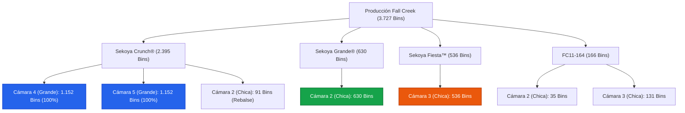

# Propuesta de Distribución de Almacenamiento (Fall Creek)

Este documento presenta de forma visual y estructurada la distribución de almacenamiento recomendada para los **3.727 bins** de Fall Creek, optimizando la pureza por cámara y reduciendo a cero los riesgos logísticos de mezcla de variedades.

---

### Infografía de Distribución en Cámaras

---

### Esquema Lógico de Distribución (Propuesta A)

---

### Tabla de Ocupación por Cámara

| Cámara | Capacidad (SOS) | Variedad / Bins Asignados | Ocupación Fís. | Holgura / Observaciones |
| :--- | :---: | :--- | :---: | :--- |
| **Cámara 4** *(Grande)* | **1.152** | 🔵 **Sekoya Crunch®**: 1.152 | **100%** | Monovarietal pura. Trazabilidad óptima. |
| **Cámara 5** *(Grande)* | **1.152** | 🔵 **Sekoya Crunch®**: 1.152 | **100%** | Monovarietal pura. Trazabilidad óptima. |
| **Cámara 2** *(Chica)* | **756** | 🟢 **Sekoya Grande®**: 630 🔵 **Sekoya Crunch®**: 91 *(Rebalse)* 🔴 **FC11-164**: 35 *(Rebalse)* | **100%** | Segregar Crunch y FC11-164 en pasillos específicos. |
| **Cámara 3** *(Chica)* | **756** | 🟠 **Sekoya Fiesta™**: 536 🔴 **FC11-164**: 131 | **88,2%** | **89 bins de espacio libre (pulmón operativo)**. |
| **Total** | **3.816** | **Asignados: 3.727 Bins** | **97,6%** | **Toda la producción de la temporada cabe en planta**. |

---

### Recomendaciones Operativas para el Cliente
1. **Cámara 3 Libre de Crunch:** Permite al equipo de patio trabajar despachos de *Sekoya Fiesta* y *FC11-164* con cero riesgo de despachar *Crunch* por error.
2. **Cámaras Grandes Monovarietales (4 y 5):** Al contener únicamente *Sekoya Crunch*, se puede operar con flujo continuo sin preocuparse de mezclar pasillos.
3. **Segregación en Cámara 2:** Los 91 bins de *Crunch* y los 35 bins de *FC11-164* deben colocarse en las columnas exteriores para mantener el bloque de *Sekoya Grande* (630 bins) completamente ordenado y accesible.
