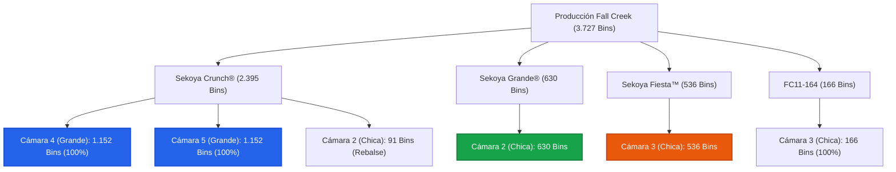

# Propuesta de Distribución: Capacidad 792 en Cámaras Chicas

Este documento presenta la simulación y análisis de distribución optimizada considerando que las **Cámaras Chicas (2 y 3)** incrementan su capacidad total a **792 Bins** cada una.

---

### Infografía de Distribución (Capacidad 792)

---

### Esquema Lógico de Distribución (Estrategia Limpia)

---

### Tabla de Ocupación con Capacidad 792

| Cámara | Capacidad | Variedad / Bins Asignados | Ocupación Fís. | Holgura / Observaciones |
| :--- | :---: | :--- | :---: | :--- |
| **Cámara 4** *(Grande)* | **1.152** | 🔵 **Sekoya Crunch®**: 1.152 | **100%** | Monovarietal pura. Trazabilidad perfecta. |
| **Cámara 5** *(Grande)* | **1.152** | 🔵 **Sekoya Crunch®**: 1.152 | **100%** | Monovarietal pura. Trazabilidad perfecta. |
| **Cámara 2** *(Chica)* | **792** | 🟢 **Sekoya Grande®**: 630 🔵 **Sekoya Crunch®**: 91 *(Rebalse)* | **91,0%** | **71 bins libres**. Muy limpia (solo 2 variedades). |
| **Cámara 3** *(Chica)* | **792** | 🟠 **Sekoya Fiesta™**: 536 🔴 **FC11-164**: 166 | **88,6%** | **90 bins libres**. Monovarietal pura de estas dos. |
| **Total** | **3.888** | **Asignados: 3.727 Bins** | **95,8%** | **161 Bins libres de holgura total combinada**. |

---

### Ventajas de este escenario (Capacidad 792)
1. **Separación de FC11-164:** Al tener 792 bins de capacidad en la Cámara 3, **toda la variedad FC11-164 (166 bins) cabe completa en la Cámara 3** junto con *Sekoya Fiesta*. Ya no es necesario partirla en dos cámaras como en el escenario de 756.
2. **Cámara 2 más holgada:** Solo contiene *Sekoya Grande* y el rebalse de *Crunch*, con una holgura de 71 bins para maniobras.
3. **Mayor Seguridad Global:** La holgura total en planta sube de 89 a **161 bins libres** (más de un 4.1% de espacio libre de seguridad), lo que entrega una tremenda tranquilidad para la operación diaria.
