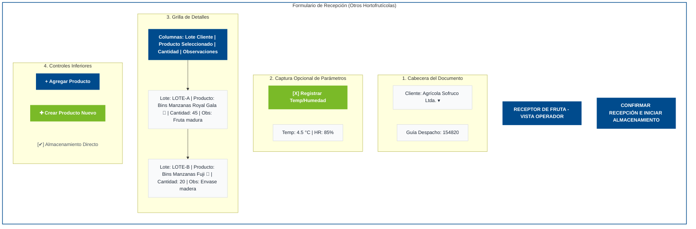
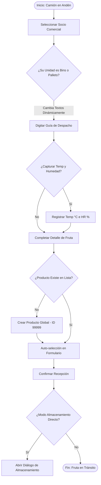
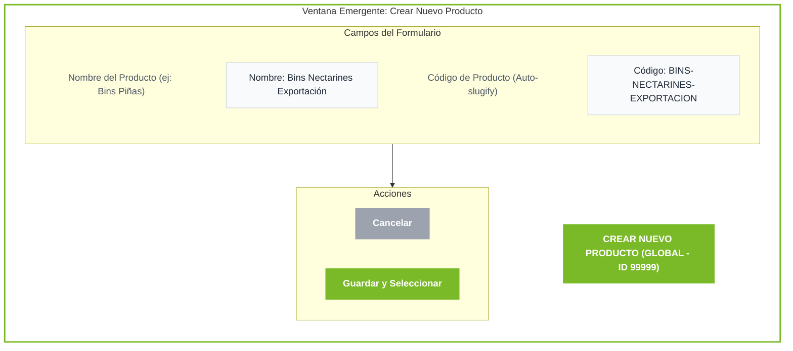
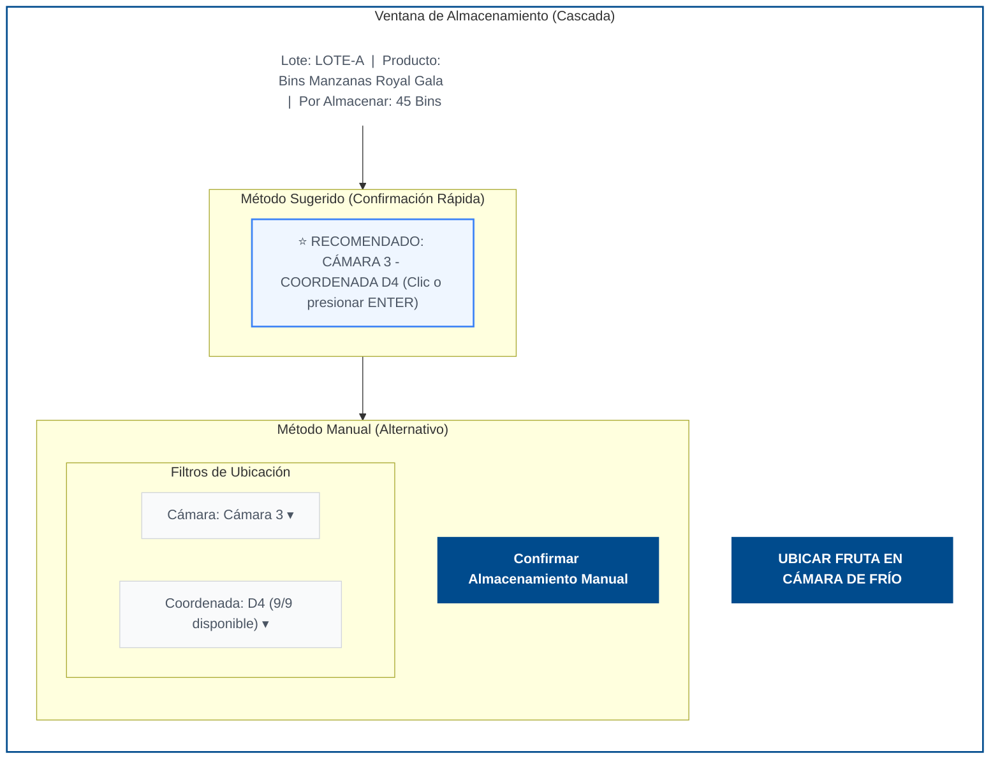
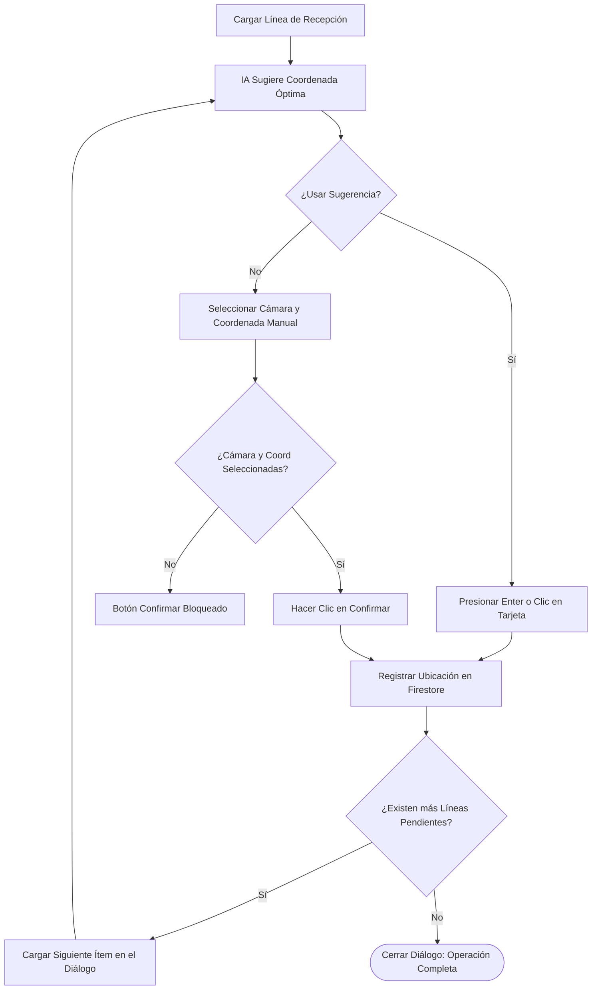
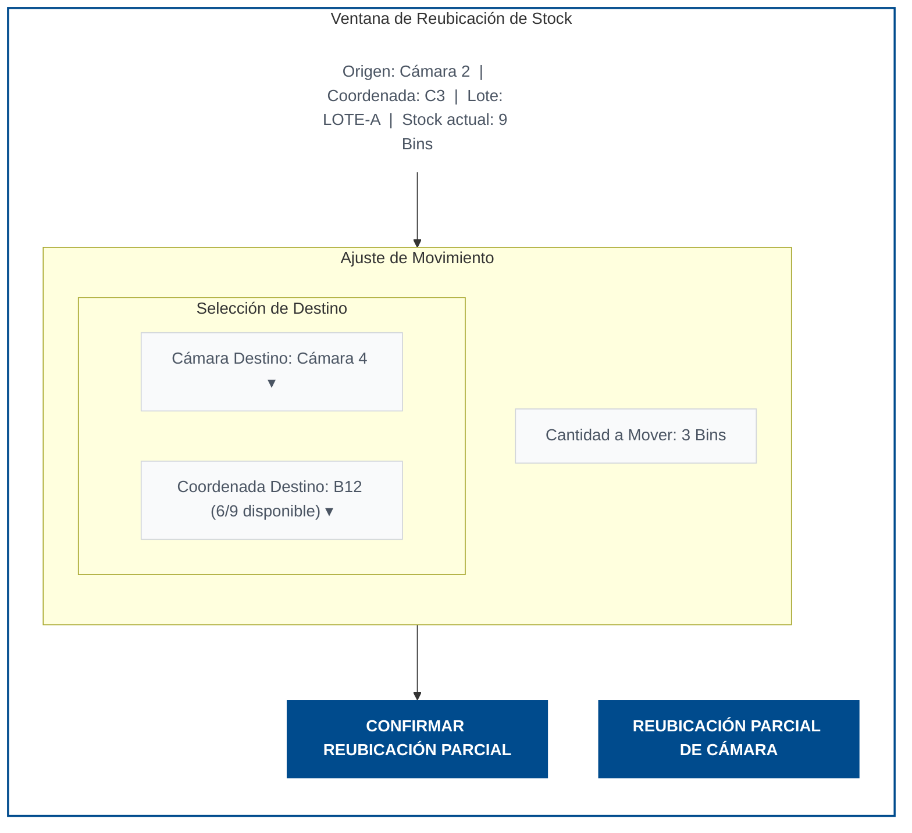
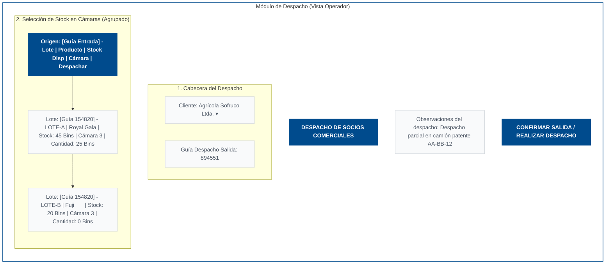

# Manual Detallado de Usuario: Gestión de Socios Comerciales (Otros Hortofrutícolas)
*Módulo de Operaciones para Clientes de Fruta (No Fall Creek) - Con Flujos y Diagramas*

Este manual está diseñado para enseñar de forma detallada y paso a paso cómo operar el módulo de **Otros Hortofrutícolas** (también conocido como **Gestión de Socios Comerciales**) en el sistema **FrigoManager**. Es apto para cualquier persona que se incorpore a la operación sin conocimientos previos del sistema.

> [!NOTE]
> Este manual aplica de forma exclusiva a los clientes hortofrutícolas generales (como exportadoras o productores de manzanas, peras, naranjas, paltas, piñas, etc.) y **excluye** el flujo específico del portal auto-servicio de Fall Creek, el cual cuenta con sus propias reglas de negocio y carga de manifiestos.

---

## Índice
1. [Introducción y Conceptos Básicos](#1-introducción-y-conceptos-básicos)
2. [Paso 1: Recepción de Fruta (Ingreso)](#2-paso-1-recepción-de-fruta-ingreso)
3. [Paso 2: Creación Dinámica de Productos (Embalajes)](#3-paso-2-creación-dinámica-de-productos-embalajes)
4. [Paso 3: Almacenamiento en Cámaras de Frío](#4-paso-3-almacenamiento-en-cámaras-de-frío)
5. [Paso 4: Reubicación Parcial de Bins o Pallets](#5-paso-4-reubicación-parcial-de-bins-o-pallets)
6. [Paso 5: Despacho de Fruta (Salida)](#6-paso-5-despacho-de-fruta-salida)
7. [Paso 6: Reportes de Stock e Historial](#7-paso-6-reportes-de-stock-e-historial)
8. [Preguntas Frecuentes y Mensajes del Sistema](#8-preguntas-frecuentes-y-mensajes-del-sistema)

---

## 1. Introducción y Conceptos Básicos

### ¿Qué es un Socio Comercial?
Un **Socio Comercial** es un cliente externo al que la planta de frío le presta servicios de almacenamiento y conservación de fruta (manzanas, peras, kiwis, etc.). A diferencia del flujo principal del sistema (que está optimizado para cerezas en bins o pallets y que sigue procesos industriales estrictos de hidrocooler), el módulo de **Otros Hortofrutícolas** ofrece flexibilidad para registrar ingresos y salidas rápidas de diversos tipos de frutas.

### Conceptos Clave que debes conocer:
* **Bin**: Caja plástica o de madera grande utilizada para transportar y almacenar fruta a granel.
* **Pallet**: Plataforma de madera sobre la cual se apilan cajas terminadas de fruta.
* **Guía de Despacho (Documento)**: El número del documento legal físico con el que llega el camión cargado de fruta a la planta.
* **Lote de Cliente**: Un código alfanumérico que el cliente asigna a su fruta para diferenciar parcelas, fechas de cosecha o calidades (por ejemplo: `LOTE-MANZANAS-A1`).
* **ID de Cliente 99999**: Un código interno del sistema que agrupa a todos los **productos globales**. Si creas un producto bajo este ID, estará disponible para todos los clientes de fruta del sistema.

---

## 2. Paso 1: Recepción de Fruta (Ingreso)

Este proceso registra la llegada física de la fruta al andén de recepción de la planta.

### Procedimiento paso a paso:

1. **Ingresa al Módulo**:
   * En el menú lateral izquierdo, haz clic en **Otros Hortofrutícolas**.
   * Asegúrate de estar en la pestaña **Recepción** (es la pestaña que se muestra por defecto).

2. **Selecciona al Socio Comercial (Cliente)**:
   * Haz clic en el menú desplegable **Socio Comercial** y selecciona el nombre del cliente que envía la fruta.
   * > [!IMPORTANT]
     > Al seleccionar el cliente, el sistema detectará automáticamente su unidad de medida configurada (ya sea **Bins** o **Pallets**). Toda la interfaz y los textos de cantidades se adaptarán dinámicamente a esta unidad.

3. **Indica el Documento de Entrada**:
   * Escribe el número de la **Guía de Despacho** en el campo **Documento**. Este número es obligatorio.

4. **Registra la Temperatura (Opcional)**:
   * Si la fruta viene con un termómetro o si se mide su temperatura al llegar, activa el interruptor **Capturar Temperatura** y escribe el valor en grados Celsius (°C).

5. **Completa las Líneas de Detalle del Formulario**:
   Por defecto, el sistema te muestra una fila vacía para agregar el primer producto. Cada fila tiene los siguientes campos:

   * **Lote Cliente**: Escribe el código identificador que tu cliente le dio a este lote específico de fruta. Si no tiene lote, puedes dejarlo vacío o usar un guion (`-`).
   * **Nombre Producto (Buscador Combobox)**:
     * Haz clic en el botón que dice **"Seleccione un producto..."**.
     * Se abrirá una ventana emergente de búsqueda rápida. Escribe parte del nombre del producto (por ejemplo, escribe `"Manzana"` o `"Pera"`).
     * El sistema filtrará automáticamente la lista. Haz clic sobre el producto deseado para seleccionarlo.
     * > [!TIP]
       > **Memoria de Producto**: El sistema recordará de forma inteligente el último producto que seleccionaste para este cliente específico y lo pre-seleccionará de forma automática en futuros ingresos, ahorrándote clics.
   * **Cantidad**: Digita el número de Bins o Pallets que ingresan. Debe ser un número entero mayor a cero.
   * **Observación**: Reemplaza el peso físico por cualquier comentario alfanumérico importante (por ejemplo: `"Fruta madura"`, `"Bins de madera"`, o `"Cajas con humedad"`).

6. **Agregar más Productos**:
   * Si el camión trae diferentes tipos de frutas en la misma guía de despacho, haz clic en el botón **Agregar Producto** en la parte inferior izquierda de la tabla. Se añadirá una nueva fila en el formulario para registrar otro detalle.
   * Para eliminar una fila que agregaste por error, haz clic en el botón con el ícono de basura roja al final de la línea.

7. **Confirmar la Recepción**:
   * Revisa que todos los datos coincidan con la guía física.
   * Haz clic en el botón **Confirmar Recepción** (abajo a la derecha).
   * Si la opción **"Almacenamiento Directo"** está activada (lo cual se recomienda para agilizar el proceso), el sistema abrirá automáticamente el diálogo para ubicar la fruta en la cámara de frío sin obligarte a salir de la pantalla.

### Esquema de Interfaz: Formulario de Recepción

### Flujo Lógico de Recepción e Ingresos

---

## 3. Paso 2: Creación Dinámica de Productos (Embalajes)

¿Qué pasa si llega una fruta nueva (por ejemplo, **Piñas**) y el producto no existe en la lista desplegable? El operador tiene la autonomía de crearlo de inmediato sin salir del formulario de recepción.

### Procedimiento paso a paso:

1. En la parte inferior de la tabla de ítems de recepción, haz clic en el botón **Crear Producto** (tiene un color verde distintivo).
2. Se abrirá una ventana emergente titulada **"Crear Nuevo Producto (Embalaje)"**.
3. **Nombre del Producto**:
   * Escribe el nombre descriptivo de la fruta y su envase. Ejemplo: `Bins Piñas`.
4. **Código del Producto**:
   * El sistema generará automáticamente un código simplificado (slug) a medida que escribes el nombre (ejemplo: `BINS-PINAS`), eliminando acentos y espacios. 
   * Si lo deseas, puedes modificar este código manualmente.
5. **Guardar**:
   * Haz clic en el botón **Crear Producto** en la ventana emergente.
   * > [!IMPORTANT]
     > Al hacer clic, el sistema creará automáticamente el producto en la base de datos de **Datos Maestros (Embalajes)** asignándole el ID de cliente `"99999"`. Esto garantiza que el producto sea global y esté disponible para todos los socios comerciales de fruta en el futuro.
   * Al crearse exitosamente, el sistema **seleccionará automáticamente** el nuevo producto en la fila actual de tu formulario y lo guardará en la memoria local de selección.

### Esquema de Interfaz: Creación Dinámica de Producto

---

## 4. Paso 3: Almacenamiento en Cámaras de Frío

Una vez confirmada la recepción, la fruta debe ser ubicada físicamente dentro de una cámara de frío para su conservación. El sistema te guiará fila por fila en este proceso.

### Flujo de Almacenamiento Secuencial (en Cascada):

Si registraste una recepción con 3 productos distintos, el sistema automatiza la secuencia:
1. Abrirá el diálogo de almacenamiento para la **primera línea** de fruta.
2. Al confirmar su ubicación, el diálogo **no se cerrará**; en su lugar, cargará automáticamente los datos de la **segunda línea** que esté pendiente de almacenar.
3. El ciclo continuará hasta que todas las líneas del documento de recepción estén guardadas en sus respectivas coordenadas, ahorrando tiempo al operador de grúa.

### Métodos para Confirmar Ubicación:

#### Método A: Confirmación Rápida (Recomendado)
El motor de inteligencia del sistema analiza el espacio disponible en las cámaras de frío y te sugiere una ubicación óptima (Cámara y Coordenada) basada en la variedad y los lotes que ya están guardados en esa zona.
1. En la pantalla del diálogo de almacenamiento, verás una tarjeta destacada que dice **"Confirmación Rápida"** (por ejemplo: *Cámara 3 - Coordenada D4*).
2. Si estás de acuerdo con la sugerencia física de la grúa, simplemente presiona la tecla **Enter** en tu teclado o haz clic directamente sobre la tarjeta de sugerencia.
3. La fruta se registrará en esa ubicación al instante.

#### Método B: Selección Manual
Si por razones logísticas la fruta no se puede colocar en la coordenada sugerida por el sistema:
1. En los menús desplegables del formulario manual, selecciona la **Cámara** de destino (de la 2 a la 5).
2. Selecciona la **Coordenada** exacta (por ejemplo: `B12`).
3. Revisa la capacidad disponible que te indica el sistema en tiempo real.
4. Haz clic en el botón **Confirmar Almacenamiento**.
5. > [!WARNING]
   > El botón **Confirmar Almacenamiento** permanecerá deshabilitado si no has seleccionado de forma explícita una Cámara y una Coordenada válidas. El sistema tiene protecciones internas para evitar que se asigne fruta a ubicaciones vacías o inexistentes (índices inválidos).

### Esquema de Interfaz: Diálogo de Almacenamiento Directo en Cascada

### Flujo de Almacenamiento en Cascada

---

## 5. Paso 4: Reubicación Parcial de Bins o Pallets

Durante el periodo de conservación, es común tener que mover fruta de una coordenada a otra para reordenar las cámaras o dar paso a inspecciones de calidad. El sistema permite fraccionar el stock de una coordenada.

### Procedimiento paso a paso:

1. Ve al módulo de **Cámaras** en el menú lateral.
2. Selecciona la cámara donde está la fruta y localiza la coordenada de origen (por ejemplo: `C3`).
3. Haz clic en la coordenada para ver los lotes almacenados.
4. Selecciona el lote y haz clic en **Reubicar Lote**.
5. **Cantidad a Reubicar**:
   * El sistema te mostrará un campo numérico pre-poblado con el total de bins disponibles en esa coordenada.
   * Modifica esta cantidad si solo quieres mover una parte del lote (ejemplo: mover 3 bins de un total de 9).
6. **Selección del Destino**:
   * Selecciona la **Cámara de Destino** y la **Coordenada de Destino**.
   * > [!IMPORTANT]
     > **Filtros en Tiempo Real**: El selector de coordenadas de destino solo te mostrará aquellas ubicaciones que tengan espacio suficiente para albergar la cantidad exacta que escribiste en el campo "Cantidad a Reubicar".
7. **Reglas de Capacidad Máxima**:
   * El límite físico estricto es de **9 Bins por coordenada**.
   * Si intentas reubicar una cantidad que exceda este límite o que supere la capacidad restante de la coordenada de destino, el sistema **bloqueará el envío**, mostrará una alerta de error indicando `"Límite máximo 9 Bins"` y mantendrá el diálogo abierto para que corrijas la selección.
8. Haz clic en **Confirmar Reubicación**. El sistema restará la cantidad del origen y creará una nueva partición del lote en el destino de manera limpia y automática.

### Esquema de Interfaz: Diálogo de Reubicación Parcial

---

## 6. Paso 5: Despacho de Fruta (Salida)

Cuando el cliente solicita retirar su fruta post-durmancia para su entrega, debemos dar salida del inventario al camión de despacho.

### Procedimiento paso a paso:

1. En el módulo **Otros Hortofrutícolas**, ve a la pestaña **Salida**.
2. **Selecciona al Socio Comercial**: El sistema cargará de inmediato la fruta que este cliente tiene almacenada en las cámaras de frío.
3. **Agrupación Inteligente de Lotes**:
   * Para facilitar la carga del camión, el stock disponible se agrupa por una **clave compuesta única**: `[Guía de Entrada] - [Lote Cliente]`.
   * Esto te permite visualizar de forma separada los ingresos y lotes específicos del cliente, posibilitando despachar de forma selectiva exactamente lo que el cliente solicita.
4. **Indica el Documento de Salida**: Escribe el número de la **Guía de Despacho de Salida** en el campo correspondiente.
5. **Selecciona las Cantidades a Despachar**:
   * En el listado de lotes del cliente, ingresa la cantidad de Bins o Pallets que subirás al camión. El sistema validará que no intentes despachar más unidades de las que realmente existen en stock.
6. **Registra la Observación de Salida**: Escribe cualquier anotación relevante sobre el despacho en el campo de texto.
7. **Confirmar Despacho**: Haz clic en **Confirmar Salida**. El sistema dará de baja la fruta de las ubicaciones físicas en las cámaras y registrará el movimiento en el historial.

### Esquema de Interfaz: Formulario de Despacho (Salida)

---

## 7. Paso 6: Reportes de Stock e Historial

Para auditar y entregar información a los clientes, contamos con dos reportes dedicados a la fruta de terceros.

### A. Reporte de Stock por Ubicación
Este reporte muestra exactamente qué fruta hay guardada en la planta en este preciso momento.
* **Ubicación**: Menú Lateral $\rightarrow$ **Reportes** $\rightarrow$ **Stock por Ubicación Clientes**.
* **Filtros en Cascada Inteligentes**:
  * Cuenta con tres selectores: **Cliente**, **Producto**, y **Cámara**.
  * Al seleccionar un filtro (por ejemplo, seleccionar el cliente *SOF*), los demás selectores se restringen automáticamente para mostrar solo opciones válidas que contengan stock de ese cliente.
  * Si la selección de un filtro se vuelve inválida al cambiar otro (por ejemplo, si tenías seleccionada la *Cámara 5* pero seleccionas un cliente que no tiene nada en esa cámara), el sistema restablecerá automáticamente el filtro secundario a `"Todos"` para evitar que la tabla quede vacía por error.
* **Fila de Totales Dinámica**:
  * En la parte inferior de la tabla se encuentra una fila de totales.
  * Si toda la fruta filtrada usa la misma unidad (ej: solo Bins), se mostrará el total de unidades alineado bajo la columna cantidad (ej: `1,250 Bins`).
  * Si hay una mezcla de unidades en el stock filtrado, la columna se fusionará y mostrará el desglose detallado (ej: `1,100 Bins / 15 Pallets`).
* **Exportar**: Puedes hacer clic en **Exportar** para descargar el reporte en formato CSV compatible con Microsoft Excel.

### B. Reporte Kardex de Fruta
Este reporte es una bitácora cronológica de todos los movimientos históricos (Ingresos y Salidas) de fruta de terceros.
* **Ubicación**: Menú Lateral $\rightarrow$ **Reportes** $\rightarrow$ **Kardex Fruta Clientes**.
* Muestra la fecha del movimiento, el tipo (Entrada/Salida), el cliente, el documento, el lote, el producto, la cantidad y la columna **Observación** (donde se consolidan las anotaciones registradas durante el ingreso o despacho).

---

## 8. Preguntas Frecuentes y Mensajes del Sistema

#### ¿Por qué el botón "Confirmar Almacenamiento" está deshabilitado?
Porque no has seleccionado una Cámara o una Coordenada en el formulario de selección manual. Asegúrate de que no muestre la leyenda `"Seleccione..."`.

#### ¿Qué significa la advertencia visual "⚠" en una celda del visualizador de cámaras?
Significa que esa coordenada contiene **lotes mezclados** (por ejemplo, bins de diferentes guías de despacho o diferentes lotes del cliente). El sistema dibuja un fondo con gradiente de colores para alertar al operador que la celda es mixta y que se debe tener precaución al retirar la fruta para no despachar un lote equivocado.

#### ¿Por qué no veo las Cámaras 1 y 6 en el módulo de Fall Creek?
Por definición operativa de la planta, los bins de Fall Creek únicamente se almacenan en las cámaras **2, 3, 4 y 5**. Para simplificar la vista y evitar errores de asignación, las cámaras 1 y 6 están bloqueadas y no se muestran en ese portal.

#### ¿Cómo se registra la temperatura y la humedad en las cámaras?
Al lado del nombre de cada cámara en el visualizador general y en el módulo de Fall Creek, verás las mediciones actuales (ej: `T: 1.2°C H: 85%`). Al hacer clic sobre estas mediciones, se abrirá un panel emergente donde podrás ingresar manualmente los nuevos valores medidos. Al guardar, quedará registrado quién hizo el ingreso y a qué hora.
